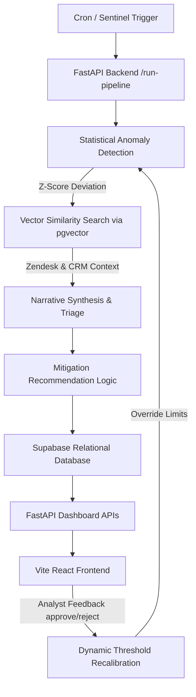

# BusinessIntelligence.ai — KPI Anomaly Triage & Governance Dashboard

An enterprise-grade anomaly detection, root-cause triage, and governance system built on the **Obsidian Data Logic** design system. The system integrates statistical time-series baselines, semantic similarity searches across support logs via vector databases, automated LLM-led narrative synthesis, and a human-in-the-loop (HITL) threshold recalibration feedback cycle.

---

## 🚀 System Architecture



---

## 🛠️ Key Capabilities

1. **Sentinel Anomaly Detector (`pipeline/reconcile.py` & `pipeline/recalibrate.py`):**
   * Computes dynamic baseline standard deviations and rolling means.
   * Compares daily values to baseline distributions to identify material shifts.
   * Adjusts anomaly thresholds globally and dynamically based on analyst rejection logs in `feedback_logs`.

2. **Semantic Vector Evidence Gate (`pipeline/investigate.py`):**
   * Maps anomalies to operational logs (e.g. server latency metrics, Support Tickets) via Gemini text embeddings.
   * Performs cosine similarity searches on PostgreSQL `pgvector` schemas to identify incident-correlated customer tickets.
   * Approves anomalies with strong root-cause evidence or flags them as **Unconfirmed** warnings.

3. **Low-Confidence Abstentions (`pipeline/judge.py`):**
   * Assigns confidence scores based on correlation strengths and history length.
   * Alerts with confidence scores $< 50\%$ (e.g. West Region Latency) are automatically **Abstained** from system actions.
   * Generates custom, context-specific SRE clarifying questions for analyst input.

4. **Entitlements & Security Row-Level Check (`api/main.py`):**
   * Implements FastAPI middleware to parse user personas.
   * **CFO Role:** Enforces column-level redaction on customer PII names in returned ticket evidence.
   * **Regional Ops Manager:** Enforces row-level container boundaries, isolating feed events strictly to their assigned region.

5. **Telemetry Cost Governance (`telemetry/logger.py`):**
   * Records execution cost, response latency, prompt tokens, and completion tokens on every LLM-generated incident.
   * Surfaces a complete execution graph separating LLM and Non-LLM stages.

---

## 📋 The Five monitored KPIs

| KPI | Simulated source | Grain | Cadence | Default Thresholds |
|---|---|---|---|---|
| **Revenue** (by region) | Warehouse DB | Daily | Nightly batch | 10% drop / $5,000 |
| **Support Ticket Volume** | Zendesk-style API | Event-level | Real-time | 25% volume spike |
| **Marketing Spend** (by campaign) | Ad-platform API | Weekly | Weekly | 15% spend shift |
| **Server Latency** | Monitoring stack | Hourly | Hourly | 15% latency spike |
| **Customer Churn** | CRM export | Monthly | Monthly | 10% churn increase |

---

## 🎯 Demo Scenarios Baked In

1. **Acute Case:** Payment-gateway outage — revenue drop + ticket spike in the same 15-minute window, one region (Southeast).
2. **Structural Case:** A slow 30-day decline in Northeast revenue with no single trigger.
3. **Unconfirmed/Abstention Case:** Latency correlated with a revenue dip in the West region, but no ticket/log evidence exists. Triggers a clarifying question.
4. **Sparse-History Case:** A newly launched region with under 8 weeks of historical data.

---

## 🧑‍💼 Personas Supported

* **CFO / Finance:** Focused on financial impact. Prompt outputs are framed with board-ready summary paragraphs and dollar/margin impact terminology. PII values in ticket descriptions are strictly redacted on the server.
* **Regional Ops Manager:** Focused on immediate operational fixes. Isolated strictly to their region (e.g. Southeast ops manager cannot query Northeast incidents, returning a `403 Forbidden` blockade).

---

## 📖 AGENTS.md — Target Guidelines

### 1. Project Context & Non-Negotiables
* **LLM Narration Only:** The LLM is a narration/interpretation layer only. It is never the source of a number. Every anomaly score, correlation, contribution %, causal estimate, or confidence score must come from deterministic logic, SQL, statistics, or traditional ML.
* **No Auto-Execution:** Every recommended action ends at a "Review & Authorize" button. There is no code path where the system acts on the business without a human click.
* **RBAC Before Prompts:** Row/column/domain security is enforced in the API/middleware layer, before any data is assembled into an LLM prompt. The LLM must never see data outside the caller's entitlement.
* **Evidence Gate is an AND:** A candidate driver metric is only accepted if it is BOTH statistically correlated with the anomaly AND backed by a corroborating evidence record (ticket, log, campaign flag). Correlation alone = "rejected, no evidence."
* **Locked Confidence Scores:** The LLM may phrase a score, never invent or adjust one.
* **Abstention is a Code Path:** If no confidence track clears the minimum floor, the pipeline returns `abstain: true` with a clarifying question.
* **Telemetry logging:** Every LLM call is telemetry-logged with prompt/completion tokens, latency, cost, and incident ID.

### 2. Definition of Done for Prototype
* A material anomaly detected and prioritized (Detect).
* A multi-factor movement with more than one contributing driver (Investigate + Judge).
* One abstention case where the system asks a clarifying question instead of guessing (Judge).
* One sparse-history case flagged as a low-confidence estimate (Detect).
* Two different persona narratives for the same underlying event (Act).
* A Review & Authorize action that logs a decision without auto-executing (Act).
* A role-based security scenario proving data isolation between personas (Act/API).
* An evidence drill-down showing source freshness, method, contribution %, confidence, and lineage for at least one insight (Act/API).
* A telemetry panel showing real token/latency/cost numbers, plus a clear list of which calls in that run were LLM vs. non-LLM (Telemetry).

---

## 🛠️ Phase-by-Phase Build Plan

```text
Phase 0: Setup & Scaffolding ──> Phase 1: Seed Data ──> Phase 2: KPI Contracts
                                                               │
Phase 5: Judge ◄── Phase 4: Investigate ◄── Phase 3: Detect ◄──┘
   │
   └──► Phase 6: Act ──► Phase 7: Feedback Loop ──► Phase 8: API ──► Phase 9: Telemetry ──► Phase 10: Frontend
```

### Phase 0 — Setup & Scaffolding
Set up the running skeleton with basic folders and database containerization. Confirm that API endpoints and dev servers are reachable locally.

### Phase 1 — Seed Data & Simulated Sources
Build seed tables/CSVs simulating heterogeneous sources. Ingest payment outages, slow declines, unconfirmed latency spikes, and sparse-history region records.

### Phase 2 — KPI Semantic Contract
Design YAML schemas for monitored KPIs. Define tables, refresh cadences, Access Restrictions, and default materiality limits. Build a calendar alignment engine (`reconcile.py`).

### Phase 3 — Detect
Calculate trailing rolling means and standard deviations. Calculate z-scores to isolate anomalies and apply sparse-history Category/Cohort fallbacks.

### Phase 4 — Investigate
Query candidates for lead-lag Pearson correlation. Vectorize Zendesk customer tickets via embeddings and execute cos-sim vector queries for time-window matching.

### Phase 5 — Judge
Classify results into confidence tracks (Acute / Structural / Unconfirmed / External). Implement minimum confidence floors ($<50\%$) that result in automated abstention blocks.

### Phase 6 — Act
Design prompt templates for CFO vs. Ops Manager. Draft action checklists from local lever mappings. Enforce server-side security checks before calling LLMs.

### Phase 7 — Feedback Loop & Recalibration
Implement the scheduled override sync (`recalibrate.py`). Count analyst rejections to raise detection thresholds dynamically and prevent alert fatigue.

### Phase 8 — API & Orchestration
Build the `/api/run-pipeline` orchestrator, `/api/reports` feed endpoint, and `/api/decision` analyst logger.

### Phase 9 — Telemetry & Cost Governance
Expose token counters, latency trackers, and step diagrams.

---

## 📦 Project Directory Structure

```text
├── api/
│   └── main.py              # FastAPI Application endpoints (RBAC, Telemetry, Reconcile, Decisions)
├── contracts/
│   └── kpi_contracts.yaml   # Semantic definitions for the 5 monitored KPIs
├── data/
│   ├── generate_seed.py     # Generates realistic synthetic multi-region metrics
│   └── load_seed.py         # Seeds Supabase tables (metrics, tickets, embeds)
├── pipeline/
│   ├── investigate.py       # cos-sim vector ticket searches
│   ├── judge.py             # Assigns tracks & handles low-confidence abstention rules
│   ├── recalibrate.py       # Threshold recalibrator updating DB parameters
│   ├── reconcile.py         # Time-series alignment and grain mapping
│   └── verify_e2e.py        # Automated test verification suite
└── web/
    ├── index.html           # Tailwind CDN & fonts injection
    ├── src/
    │   ├── App.jsx          # Tab-driven dashboard (Overview, Intelligence, Audits, Telemetry)
    │   ├── index.css        # Obsidian visual themes (grid overlays, custom technical inputs)
    │   └── main.jsx
    └── package.json
```

---

## 🏃 Setup & Installation

### 1. Prerequisites
* Python 3.10+
* Node.js v18+
* PostgreSQL Database (with `pgvector` extension enabled)

### 2. Backend Setup
1. Create a Python Virtual Environment:
   ```bash
   python -m venv venv
   source venv/bin/activate  # On Windows: .\venv\Scripts\activate
   ```
2. Install python packages:
   ```bash
   pip install -r requirements.txt
   ```
3. Set environment variables in a `.env` file in the root directory:
   ```env
   SUPABASE_DB_URL="postgresql://postgres:[password]@[host]:5432/postgres"
   GEMINI_API_KEY="your-api-key"
   ```
4. Seed the database with telemetry, tickets, and embeddings:
   ```bash
   python data/load_seed.py
   ```

### 3. Run API & Frontend
1. Start the FastAPI backend:
   ```bash
   python -m uvicorn api.main:app --host 0.0.0.0 --port 8000
   ```
2. Start the Vite React development server:
   ```bash
   cd web
   npm install
   npm run dev
   ```
3. Open your browser and navigate to `http://localhost:5173`.

---

## 🧪 Running Automated E2E Verification
Verify the entire analytical workflow and role entitlements instantly:
```bash
python pipeline/verify_e2e.py
```
*(All 6 validation steps, including regional row blockades and CFO column redactions, must pass.)*

---

## 🔍 Database Table Schemas (Technical Deep-dive)

### 1. `feedback_logs` (Analyst overrides audit)
```sql
CREATE TABLE feedback_logs (
    id SERIAL PRIMARY KEY,
    incident_id VARCHAR(100) NOT NULL,
    decision VARCHAR(50) NOT NULL,  -- 'approve' or 'reject'
    adjusted_narrative TEXT,
    adjusted_action TEXT,
    analyst_comments TEXT,
    created_at TIMESTAMP WITH TIME ZONE DEFAULT CURRENT_TIMESTAMP
);
```

### 2. `telemetry_logs` (API cost governance audit)
```sql
CREATE TABLE telemetry_logs (
    id SERIAL PRIMARY KEY,
    incident_id VARCHAR(100) NOT NULL,
    stage VARCHAR(100) NOT NULL,    -- 'triage', 'narrative', 'recs'
    model_name VARCHAR(100) NOT NULL,
    input_tokens INTEGER NOT NULL,
    output_tokens INTEGER NOT NULL,
    latency_ms INTEGER NOT NULL,
    estimated_cost_usd DOUBLE PRECISION NOT NULL,
    timestamp TIMESTAMP WITH TIME ZONE DEFAULT CURRENT_TIMESTAMP
);
```

### 3. `config_overrides` (Dynamic calibration coefficients)
```sql
CREATE TABLE config_overrides (
    kpi VARCHAR(50) PRIMARY KEY,
    materiality_pct_override DOUBLE PRECISION,
    materiality_abs_override DOUBLE PRECISION,
    recalibrated_at TIMESTAMP WITH TIME ZONE DEFAULT CURRENT_TIMESTAMP
);
```
