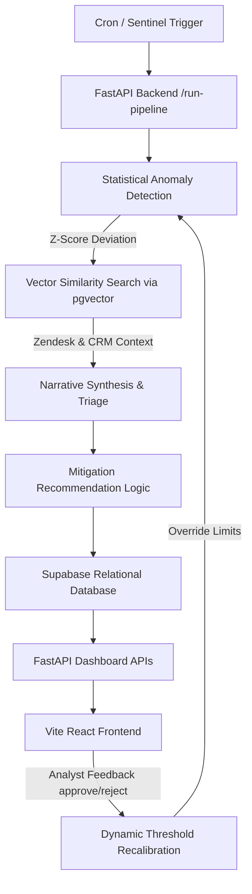

# BusinessIntelligence.ai — KPI Anomaly Triage & Governance Dashboard

An enterprise-grade anomaly detection, root-cause triage, and governance system built on the **Obsidian Data Logic** design system. The system integrates statistical time-series baselines, semantic similarity searches across support logs via vector databases, automated LLM-led narrative synthesis, and a human-in-the-loop (HITL) threshold recalibration feedback cycle.

---

## 🚀 System Architecture



---

## 🛠️ Key Capabilities

1. **Sentinel Anomaly Detector (`pipeline/reconcile.py` & `pipeline/recalibrate.py`):**
   * Computes dynamic baseline standard deviations and rolling means.
   * Compares daily values to baseline distributions to identify material shifts.
   * Adjusts anomaly thresholds globally and dynamically based on analyst rejection logs in `feedback_logs`.

2. **Semantic Vector Evidence Gate (`pipeline/investigate.py`):**
   * Maps anomalies to operational logs (e.g. server latency metrics, Support Tickets) via Gemini text embeddings.
   * Performs cosine similarity searches on PostgreSQL `pgvector` schemas to identify incident-correlated customer tickets.
   * Approves anomalies with strong root-cause evidence or flags them as **Unconfirmed** warnings.

3. **Low-Confidence Abstentions (`pipeline/judge.py`):**
   * Assigns confidence scores based on correlation strengths and history length.
   * Alerts with confidence scores $< 50\%$ (e.g. West Region Latency) are automatically **Abstained** from system actions.
   * Generates custom, context-specific SRE clarifying questions for analyst input.

4. **Entitlements & Security Row-Level Check (`api/main.py`):**
   * Implements FastAPI middleware to parse user personas.
   * **CFO Role:** Enforces column-level redaction on customer PII names in returned ticket evidence.
   * **Regional Ops Manager:** Enforces row-level container boundaries, isolating feed events strictly to their assigned region.

5. **Telemetry Cost Governance (`telemetry/logger.py`):**
   * Records execution cost, response latency, prompt tokens, and completion tokens on every LLM-generated incident.
   * Surfaces a complete execution graph separating LLM and Non-LLM stages.

---

## 📦 Project Directory Structure

```text
├── api/
│   └── main.py              # FastAPI Application endpoints (RBAC, Telemetry, Reconcile, Decisions)
├── contracts/
│   └── kpi_contracts.yaml   # Semantic definitions for the 5 monitored KPIs
├── data/
│   ├── generate_seed.py     # Generates realistic synthetic multi-region metrics
│   └── load_seed.py         # Seeds Supabase tables (metrics, tickets, embeds)
├── pipeline/
│   ├── investigate.py       # cos-sim vector ticket searches
│   ├── judge.py             # Assigns tracks & handles low-confidence abstention rules
│   ├── recalibrate.py       # Threshold recalibrator updating DB parameters
│   ├── reconcile.py         # Time-series alignment and grain mapping
│   └── verify_e2e.py        # Automated test verification suite
└── web/
    ├── index.html           # Tailwind CDN & fonts injection
    ├── src/
    │   ├── App.jsx          # Tab-driven dashboard (Overview, Intelligence, Audits, Telemetry)
    │   ├── index.css        # Obsidian visual themes (grid overlays, custom technical inputs)
    │   └── main.jsx
    └── package.json
```

---

## 🏃 Setup & Installation

### 1. Prerequisites
* Python 3.10+
* Node.js v18+
* PostgreSQL Database (with `pgvector` extension enabled)

### 2. Backend Setup
1. Create a Python Virtual Environment:
   ```bash
   python -m venv venv
   source venv/bin/activate  # On Windows: .\venv\Scripts\activate
   ```
2. Install python packages:
   ```bash
   pip install -r requirements.txt
   ```
3. Set environment variables in a `.env` file in the root directory:
   ```env
   SUPABASE_DB_URL="postgresql://postgres:[password]@[host]:5432/postgres"
   GEMINI_API_KEY="your-api-key"
   ```
4. Seed the database with telemetry, tickets, and embeddings:
   ```bash
   python data/load_seed.py
   ```

### 3. Run API & Frontend
1. Start the FastAPI backend:
   ```bash
   python -m uvicorn api.main:app --host 0.0.0.0 --port 8000
   ```
2. Start the Vite React development server:
   ```bash
   cd web
   npm install
   npm run dev
   ```
3. Open your browser and navigate to `http://localhost:5173`.

---

## 🧪 Running Automated E2E Verification
Verify the entire analytical workflow and role entitlements instantly:
```bash
python pipeline/verify_e2e.py
```
*(All 6 validation steps, including regional row blockades and CFO column redactions, must pass.)*
